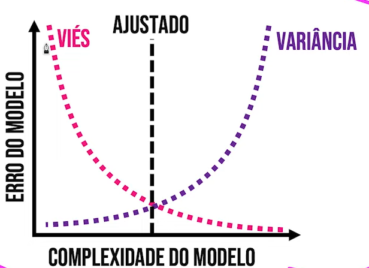

# Capítulo 2: Aprendizado de Máquina

Bloco 2.1: Tipos de Aprendizado: Supervisionado, Não Supervisionado e Por Reforço
Prática: Exemplos práticos de cada tipo de aprendizado

Bloco 2.2: Modelos de Regressão e Classificação
Prática: Implementação de modelos básicos com datasets simples

Bloco 2.3: Avaliação de Modelos e Overfitting
Prática: Avaliação de modelos usando métricas apropriadas

# Trade-off do viés e variência

 

Regressão logística é uma técnica estatística que tem como objetivo estimar a probabilidade de uma entrada pertencer à classe (variável categórica) frequentemente binária, a partir de uma série de variáveis explicativas contínuas e/ou binárias.

